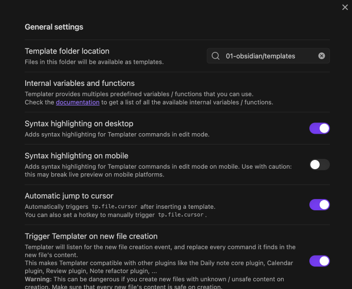

# obsisian

[obsidian](https://obsidian.md/download)

## 双向链接

语法：
```js
// [[文件名]]

// [[文件名#选择标题]]

// [[文件名|重命名的名称]]

// ![[文件名|重命名的名称]]
```

![[ob-doc#document]]

## 插件

**模板**

首先创建一个作为模板的markdown文件，然后设置“核心插件”->"模板“，指定模板文件的目录。

模板文件建议使用`tp-`前缀，以便快捷方式引入模板。


**模板增强`templater`**

在第三方插件中，可以选择安装`templater`插件作为增强自带的核心模板插件。

使用步骤：
1. 使用`templater`语法创建模板的markdown文件
2. 设置`templater`的目录
3. 调用模板文件
	+ 创建文件
	+ 插入模板文本



文件自动添加属性的示例：
```js
---
title: <% tp.file.title %>
date: <% tp.file.creation_date("YYYY-MM-DD HH:mm:ss") %>
modify: <% tp.file.last_modified_date("YYYY-MM-DD HH:mm:ss") %>
author: leleyucc
tags: 
  - <% tp.file.title %>
aliases: 
  - <% tp.file.title %>
---

# <% tp.file.title %>
```

内部变量说明：
```js
{{tp_title}}  // 取得当前文件的名称

{{tp_folder}} // 获取当前目录的名称

{{tp_folder:vault_path=true}} // 取得文本库到当前文件夹的相对路径

{{tp_date}} // 取得今日 + 偏移天数的日期
			// `f`: 指定日期格式化字符串， (缺省格式为: `YYYY-MM-DD`)
			// `offset`: 设置偏移天数，例如设定为 `-7` 时可获得上周日期 (默认值为 `0`)

{{tp_date:f="ll", offset=7}}

{{tp_cursor}}  // 将当前位置设定为套壳样章后游标的操作位置

```

[templater-文档](https://silentvoid13.github.io/Templater/)

